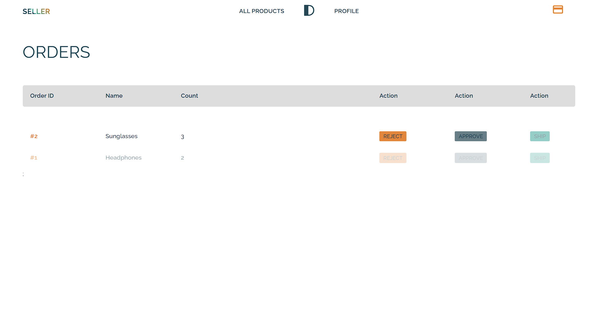

# DCart
DCart is a decentralized e-commerce website where sellers and buyers can communicate or connect which each other for 
without any central authority in-between them.

DCart is deployed on ethereum public blockchain and uses ("Ash Token") Token as from of payment inside the application.

## Features of DCart
####  User Account and Login / SignUp.


- Users can click on profile link and a modal will popup. They can fill their details and choose whether they want to sign up as a SELLER or a BUYER.


#### Profile Page.

- The profile section will display all the details of user and down below is statistic for Ethereum, Tokens, etc. and can also purchase Token from the box below.


#### Products Page

- If the user is loggedIn as SELLER, on the products page they will see a plus button from where they can add the products.


- If the user is loggedIn as SELLER, they won't see any add product button instead, they will get access to all the products added by the SELLER'S.
If they click on the particular product they will be redirected to single product page.


#### Single Product Page

- This page will show all the details and description of a particular product. BUYER can select the number of products they want to buy and then make purchase using "Ash" Tokens.


#### Orders Page

- If the user is LoggedIn as BUYER, they will see all the orders they've placed.


- If the user is LoggedIn as SELLER, they will see all the orders they have received from the CUSTOMERS. 



## How to access project locally

- Clone project.
- Download Ganache https://trufflesuite.com/ganache/ and start Ganache.
- Install metamask chrome extension, and import accounts from Ganache to Metamask.
- Inside CMD/Terminal install truffle, ```npm install -g truffle```.
- Open the project, go to terminal type ```cd/eth```, then type ```truffle deploy```.
- In terminal go to ```cd/ui``` inside it, type ```npm install``` to install all the dependencies.
- Type ```npm run dev```.
